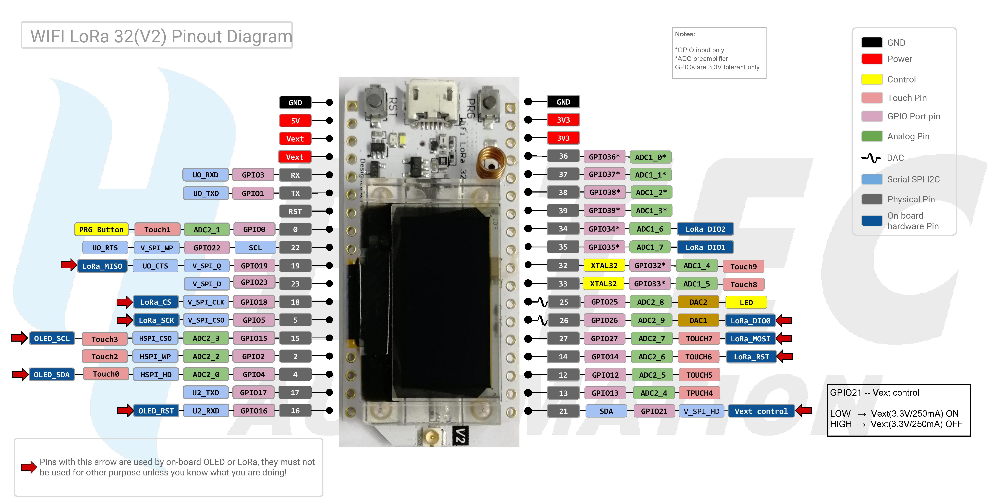

# LoraInk Concept

## Gateway

### Hardware
- Raspberry PI 3 (B) - RAK WIRELESS LoraWan Gateway - https://store.rakwireless.com/collections/lpwan-gateways-concentrators/products/rak831-gateway-module?variant=22375114801252

### Responsibilities
Access control (username/password or token)

### REST-API
- [add node] (ID)
- [remove node] (ID)
- [get connected nodes]
- [get all nodes]
- [send image to node] (JPEG, PNG or BITMAP)

### Todos
- REST-API
- LoraWan interface

## Node

### Hardware
- Arduino - HELTEC Wifi LoRa 32 v2 - https://heltec.org/project/wifi-lora-32/
- Bridge - WAVESHARE e-Paper HAT - https://www.waveshare.com/7.5inch-e-paper-hat.htm
- E-ink - WAVESHARE 7.5 Inch E-Paper (B/C) - https://www.waveshare.com/7.5inch-e-paper-c.htm

**ATTENDTION: All GPIO Pins with a * are INPUT ONLY!**

### Responsibilities
- Auto wake up
- Fetch
- Update Display

### LoraWan-API
- [write bits] (BITS)
- [sleep]?
- [status] (BATTERY-LIFE or PING)

### Todos
- C++ - LoraWan interface
- C++ - Write bitmap to E-ink
- C++ - Write to built-in OLED
- 3D-Printer - Enclosure
- Solar panels

## Handshake
The node sends a request with static id and static “proof”-id
Gateway checks “proof”-id and answers with token-id
Gateway broadcasts information across same static id but Nodes only process data if tokens match
